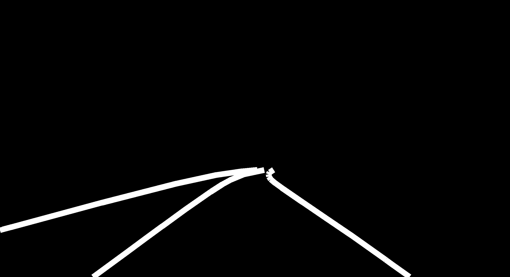
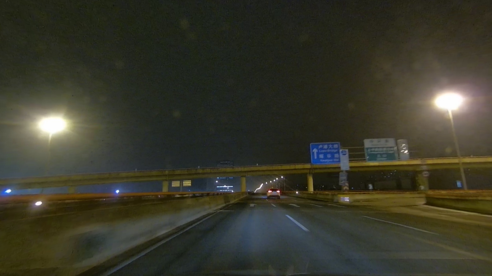
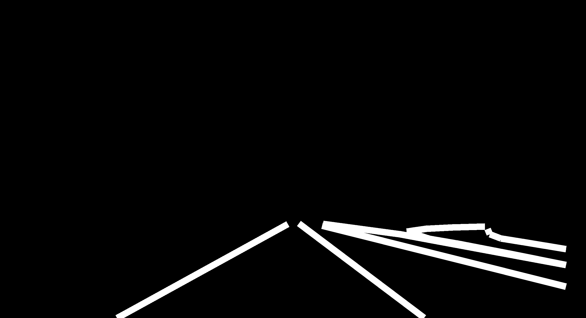
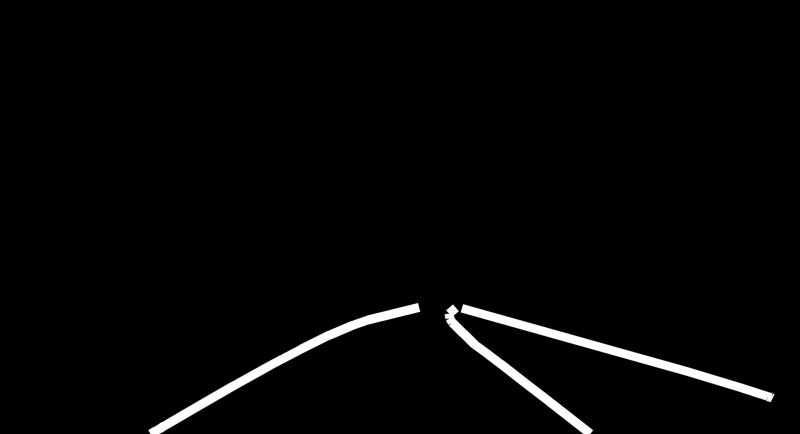
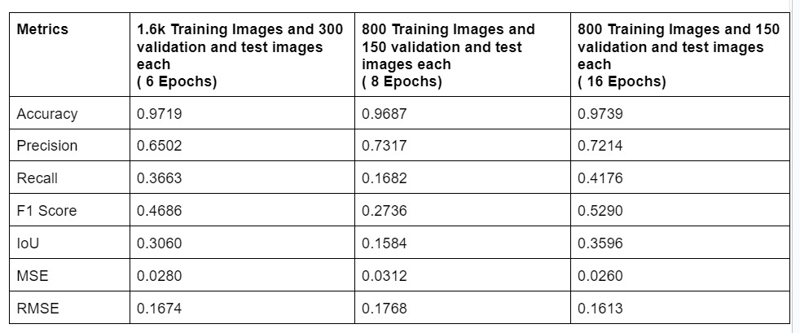

# Lane-Detection
The project aims to develop an efficient and accurate lane detection system using neural
networks to enhance the safety and autonomy of vehicles by providing real-time awareness
of lane boundaries on roads. The main challenge is to accommodate varying environmental
conditions, such as different lighting conditions, road surfaces, and diverse traffic scenarios,
to ensure robust performance across different driving scenarios

# Datasets
In order to facilitate processing within Google Colab, we aimed to reduce the size of the
CurveLanes dataset, which originally amounted to 68 gigabytes. From this extensive dataset,
we selected 1.6k images for training purposes, along with 300 images each for both validation
and testing <a href="https://drive.google.com/drive/folders/1vKLdiW1aEzlqbNBHwZiZlwQwgu82bOQ5?usp=sharing" target="_blank">cidata</a>

Due to the restricted RAM and GPU usage on colab, inorder to increase the number of
training epochs to improve the accuracy we again split the dataset into half i.e 800 images
in training dataset and 150 images for both validation and test datasets <a href="https://drive.google.com/drive/folders/1oB77rdmKt3x-EYacWD2fzesLO2mDxiSL?usp=sharing" target="_blank">cidata_half</a>

# Code Files
Halfdata_16.ipnyb file corresponds to the model trained on cidata_half dataset with 16 epochs. 
Halfdata_8.ipnyb file corresponds to the model trained on cidata_half dataset with 8 epochs. 
Fulldata_6.ipnyb file corresponds to the model trained on cidata dataset with 6 epochs.  
Inference.ipnyb file corresponds to the file containing code for inferncing and creation of user interface.

# Weights Files
<a href="https://drive.google.com/file/d/1MtOogyk-_M2TXynyITVe1Ym5NGdZgoJP/view?usp=sharing" target="_blank">weights_half_16.h5</a> file corresponds to the model weights trained on cidata_half dataset and 16 epochs.  
<a href="https://drive.google.com/file/d/1C26FCTcfDzg6LyTpFuvFC1DPbY72NGab/view?usp=sharing" target="_blank">weights_half_8.h5</a> file corresponds to the model weights trained on cidata_half dataset and 8 epochs.  
<a href="https://drive.google.com/file/d/12gwN-XOWrpfUATAwPK3gC-bpZHx_C47G/view?usp=sharing" target="_blank">weights_full_6.h5</a> file corresponds to the model weights trained on cidata dataset and 6 epochs

# Steps To Run The Code
* To load the model and perform training:
  - Open the ipnyb file in Google Colab.
  - Open the needed dataset file in Google Drive and add shortcut to MyDrive.
  - Make sure you have the dataset file and colab file in same google account.
  - Run the code.
* To do inferencing directly from user interface :
  - Open the Inferencing.ipnyb file in Google Colab. 
  - Open the needed weights file in Google Drive and add shortcut to MyDrive.
  - Make sure you have the weights file and colab file in same google account.
  - Change path to weights file in "weights_path" variable under the section "Weights Path".(Default is given to weights file of model trained on cidata_half dataset with 16 epochs)
  - Run the code.
  - Now you can open the link provided under output of the code after running the code or directly upload images to get the output of the model.
  
# Outputs
    
    
    

# Metrics
    
